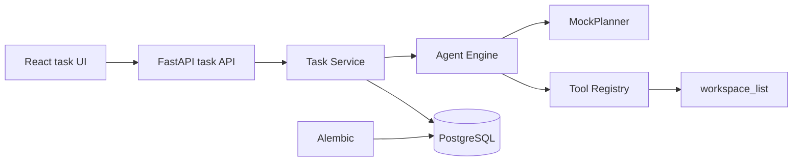

# AURA

[](LICENSE)
[](https://www.python.org/)
[](https://react.dev/)

AURA is an agentic workspace and AI orchestration platform conceived as a portfolio-grade software engineering project. The repository is currently at **Phase 1: MVP vertical slice**: a user can create a task, run one deterministic read-only agent workflow, and inspect its persisted result.

The project scope and implementation order are governed by [`AURA_Project_Blueprint_A3.pdf`](AURA_Project_Blueprint_A3.pdf).

## Phase 1 capabilities

- FastAPI application with a typed `GET /api/health` endpoint and OpenAPI documentation.
- Typed `POST /api/tasks` and `GET /api/tasks/{task_id}` endpoints for the synchronous task flow.
- Deterministic `MockPlanner` that creates one validated plan step without an external AI API.
- Agent engine, tool interface, registry, executor, and exactly one registered `workspace_list` tool.
- Read-only workspace listing constrained to the configured `WORKSPACE_ROOT`.
- PostgreSQL persistence for tasks, plans, executions, tool calls, statuses, and results through SQLAlchemy and Alembic.
- React, TypeScript, and Vite task execution UI with operational status, plan, tool, and result details.
- Reproducible local services through Docker Compose.
- Backend linting, formatting, static typing, tests, and coverage enforcement.
- Frontend linting, formatting, static typing, tests, and production builds.
- GitHub Actions checks for every push and pull request.

Real AI providers, additional tools, approvals, authentication, memory, multiple agents, and destructive actions remain intentionally out of scope.

## Architecture

Phase 1 extends the modular monolith with one end-to-end execution path:



Backend packages mirror the target architecture under `backend/app/`; placeholder packages contain no speculative implementation.

## Run with Docker Compose

Requirements: Docker with the Compose plugin.

```powershell
Copy-Item .env.example .env
docker compose up --build
```

The backend applies pending Alembic migrations before starting the API. The configured container workspace is `/app`, so the Phase 1 tool lists the backend application workspace without accepting arbitrary paths.

The local development defaults in `.env.example` are not production credentials. Change them for any shared environment.

- Frontend: <http://localhost:5173>
- API health: <http://localhost:8000/api/health>
- API documentation: <http://localhost:8000/docs>

Stop the stack with `docker compose down`. Add `--volumes` only when you explicitly want to delete the local PostgreSQL data volume.

## Run without containers

Use Python 3.13, Node.js 22 or newer, and an accessible PostgreSQL instance.

```powershell
py -3.13 -m venv .venv
.venv\Scripts\Activate.ps1
python -m pip install -r backend/requirements-dev.txt
Set-Location backend
alembic upgrade head
uvicorn app.main:app --reload
```

In a second terminal:

```powershell
Set-Location frontend
npm ci
npm run dev
```

Copy `.env.example` to `.env` before starting the backend and adjust `DATABASE_URL` when PostgreSQL is not on `localhost:5432`.

## Quality checks

```powershell
Set-Location backend
ruff check .
ruff format --check .
mypy app tests
pytest

Set-Location ../frontend
npm run format:check
npm run lint
npm run type-check
npm test
npm run build
```

Backend coverage is enforced at 80%. Frontend tests use Vitest. No test requires an AI provider or paid API.

## Environment variables

| Variable            | Purpose                                           |
| ------------------- | ------------------------------------------------- |
| `POSTGRES_DB`       | Local PostgreSQL database name used by Compose.   |
| `POSTGRES_USER`     | Local PostgreSQL user used by Compose.            |
| `POSTGRES_PASSWORD` | Local PostgreSQL password used by Compose.        |
| `DATABASE_URL`      | SQLAlchemy PostgreSQL connection URL.             |
| `CORS_ORIGINS`      | JSON array of browser origins allowed by FastAPI. |
| `WORKSPACE_ROOT`    | Fixed directory available to the read-only tool.  |
| `VITE_API_BASE_URL` | Browser-visible base URL for the API.             |

## Roadmap

- **Phase 0 - Foundation:** complete; repository, docs, Docker, application skeletons, PostgreSQL, and CI.
- **Phase 1 - MVP vertical slice:** complete; create task, deterministic mock plan, one tool, result persistence, and dashboard display.
- **Phases 2-5:** real provider abstraction, approvals, broader tooling, memory, observability, and portfolio polish.

See [Architecture](docs/architecture.md) for boundaries and [Contributing](CONTRIBUTING.md) for the development workflow.

## License

Distributed under the [MIT License](LICENSE).
