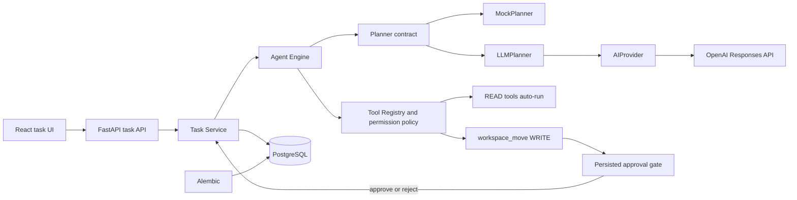

# AURA

[](LICENSE)
[](https://www.python.org/)
[](https://react.dev/)

AURA is an agentic workspace and AI orchestration platform conceived as a portfolio-grade software engineering project. The repository is currently at **Phase 3: tooling and approvals**: a user can create a one-step task, let the configured planner choose among bounded workspace tools, and explicitly approve or reject file moves before execution.

The project scope and implementation order are governed by [`AURA_Project_Blueprint_A3.pdf`](AURA_Project_Blueprint_A3.pdf).

## Phase 3 capabilities

- FastAPI application with a typed `GET /api/health` endpoint and OpenAPI documentation.
- Typed task creation/retrieval endpoints plus payload-free approval and rejection endpoints for persisted pending executions.
- Deterministic `MockPlanner` for tests and local development, selected by default.
- Vendor-neutral `AIProvider` contract and an OpenAI Responses API adapter selected through environment configuration.
- `LLMPlanner` that receives all registered tool schemas, requests strict structured output, and locally validates exactly one selected tool call before persistence or execution.
- Explicit application-owned `READ`/`WRITE` permissions: reads execute automatically and writes cannot execute without approval.
- `workspace_list`, bounded literal `workspace_search`, bounded UTF-8 `workspace_read`, and approval-required `workspace_move` tools.
- Fixed-root path validation that rejects absolute paths, traversal, symlink escapes, oversized reads, binary reads, and destination overwrites.
- PostgreSQL persistence for tasks, plans, executions, tool calls, approval decisions, statuses, and results through SQLAlchemy and Alembic.
- React, TypeScript, and Vite UI for planning, waiting, executing, completed, rejected, and failed states, including guarded Approve/Reject controls.
- Reproducible local services through Docker Compose.
- Backend linting, formatting, static typing, tests, and coverage enforcement.
- Frontend linting, formatting, static typing, tests, and production builds.
- GitHub Actions checks for every push and pull request.

Authentication, memory, multiple agents, streaming, autonomous loops, arbitrary filesystem access, deletion, shell access, and code execution remain intentionally out of scope.

## Architecture

Phase 3 preserves the modular monolith and the existing end-to-end execution path:



Backend packages mirror the target architecture under `backend/app/`; placeholder packages contain no speculative implementation.

## Run with Docker Compose

Requirements: Docker with the Compose plugin.

```powershell
Copy-Item .env.example .env
docker compose up --build
```

The backend applies pending Alembic migrations before starting the API. Application code remains under `/app`, while the host `workspace/` directory is mounted at the isolated container path `/workspace`. Every tool accepts only validated paths relative to that workspace root. `workspace_move` never overwrites and always waits for explicit approval.

The local development defaults in `.env.example` are not production credentials. Change them for any shared environment.

- Frontend: <http://localhost:5173>
- API health: <http://localhost:8000/api/health>
- API documentation: <http://localhost:8000/docs>

Stop the stack with `docker compose down`. Add `--volumes` only when you explicitly want to delete the local PostgreSQL data volume.

## Run without containers

Use Python 3.13, Node.js 22 or newer, and an accessible PostgreSQL instance.

```powershell
py -3.13 -m venv .venv
.venv\Scripts\Activate.ps1
python -m pip install -r backend/requirements-dev.txt
Set-Location backend
alembic upgrade head
uvicorn app.main:app --reload
```

In a second terminal:

```powershell
Set-Location frontend
npm ci
npm run dev
```

Copy `.env.example` to `.env` before starting the backend and adjust `DATABASE_URL` when PostgreSQL is not on `localhost:5432`.

The backend always loads the repository-root `.env`, matching the documented copy location. The example uses `WORKSPACE_ROOT=../workspace` because the local backend command runs from `backend/`; Docker Compose uses the matching isolated container path `/workspace`.

`PLANNER_BACKEND=mock` is the default and requires no provider credentials. To use the real provider, set these values in the untracked root `.env` before starting the backend:

```dotenv
PLANNER_BACKEND=openai
OPENAI_API_KEY=<your-api-key>
OPENAI_MODEL=gpt-5-mini
```

Provider requests have a configurable 1-60 second deadline, no SDK retries, a bounded output-token budget, strict structured output, and `store=false`. Startup fails with a sanitized configuration error when the OpenAI planner is selected without a key.

## Quality checks

```powershell
Set-Location backend
ruff check .
ruff format --check .
mypy app tests
pytest

Set-Location ../frontend
npm run format:check
npm run lint
npm run type-check
npm test
npm run build
```

Backend coverage is enforced at 80%. Frontend tests use Vitest. The automated suite uses deterministic provider doubles and never calls the real provider.

## Environment variables

| Variable            | Purpose                                           |
| ------------------- | ------------------------------------------------- |
| `POSTGRES_DB`       | Local PostgreSQL database name used by Compose.   |
| `POSTGRES_USER`     | Local PostgreSQL user used by Compose.            |
| `POSTGRES_PASSWORD` | Local PostgreSQL password used by Compose.        |
| `DATABASE_URL`      | SQLAlchemy PostgreSQL connection URL.             |
| `CORS_ORIGINS`      | JSON array of browser origins allowed by FastAPI. |
| `WORKSPACE_ROOT`    | Fixed directory available to bounded workspace tools. |
| `PLANNER_BACKEND`   | `mock` (default) or `openai`.                      |
| `OPENAI_API_KEY`    | Required only when `PLANNER_BACKEND=openai`.       |
| `OPENAI_MODEL`      | OpenAI model used for structured planning.         |
| `AI_PROVIDER_TIMEOUT_SECONDS` | Provider deadline from 1 through 60 seconds. |
| `AI_PROVIDER_MAX_OUTPUT_TOKENS` | Structured response budget from 128 through 2048 tokens. |
| `VITE_API_BASE_URL` | Browser-visible base URL for the API.             |

## Roadmap

- **Phase 0 - Foundation:** complete; repository, docs, Docker, application skeletons, PostgreSQL, and CI.
- **Phase 1 - MVP vertical slice:** complete; create task, deterministic mock plan, one tool, result persistence, and dashboard display.
- **Phase 2 - Real AI provider:** complete; switchable provider abstraction and validated single-step structured planning.
- **Phase 3 - Tooling and approvals:** complete; multiple bounded tools, application-enforced permissions, and persisted approval lifecycle.
- **Phases 4-5:** memory, observability, and portfolio polish.

See [Architecture](docs/architecture.md) for boundaries and [Contributing](CONTRIBUTING.md) for the development workflow.

## License

Distributed under the [MIT License](LICENSE).
