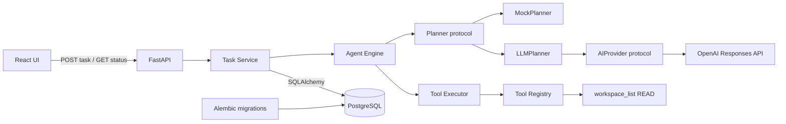

# Architecture

## Phase 2 boundary

AURA remains a modular monolith with a React frontend, FastAPI backend, and PostgreSQL database. Phase 2 replaces only the planning implementation behind the Phase 1 seam:

- `frontend/` owns the browser application.
- `backend/app/api/` owns typed HTTP contracts.
- `backend/app/core/` owns application configuration.
- `backend/app/database/` owns SQLAlchemy metadata and session construction.
- `backend/app/services/` owns task lifecycle transitions and persistence coordination.
- `backend/app/agents/` owns the validated plan contract, mock and LLM planners, and single-step engine.
- `backend/app/providers/` owns the provider protocol, sanitized failure taxonomy, and OpenAI SDK adapter.
- `backend/app/tools/` owns the tool contract, registry, executor, and fixed-root read-only workspace listing.
- `backend/app/models/` owns task, plan, execution, and tool-call records.
- `backend/alembic/` owns the matching schema migration.

The request remains synchronous because it executes exactly one bounded read-only call. Lifecycle states are still committed at task creation, planning, execution start, and completion so each record is durable. Provider, plan-validation, and tool failures become sanitized persisted operational failures rather than exposing internal payloads or tracebacks.

## Dependency direction

The API calls the task service; the service coordinates persistence and the agent engine; the engine depends only on planner and tool-executor contracts. `LLMPlanner` depends on `AIProvider`; only the application composition point selects `MockPlanner` or constructs the OpenAI adapter. Provider SDK types and credentials do not cross into the engine, service, tools, API, or frontend.

The LLM receives the user instruction and the registered `workspace_list` definition: name, description, read permission, and empty argument schema. It does not receive `WORKSPACE_ROOT` or any filesystem handle. The provider requests strict JSON Schema output with one step, then AURA independently validates the plan model, registered tool name, and tool arguments before persistence. The executor never interprets or executes model text.

## Phase boundary

This phase exposes only task creation and task retrieval. It registers exactly one tool and does not accept a path from the planner or user; `WORKSPACE_ROOT` is the execution boundary. Additional tools, approval workflows, authentication, memory, multiple agents, streaming, autonomous loops, destructive actions, and advanced observability remain out of scope until their roadmap phases.
