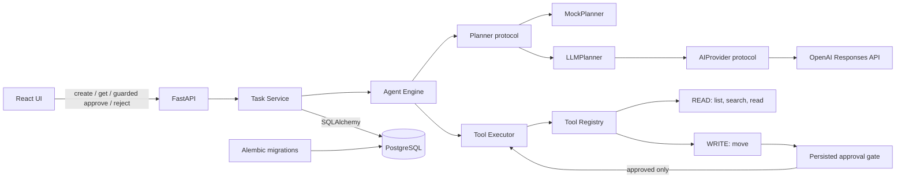
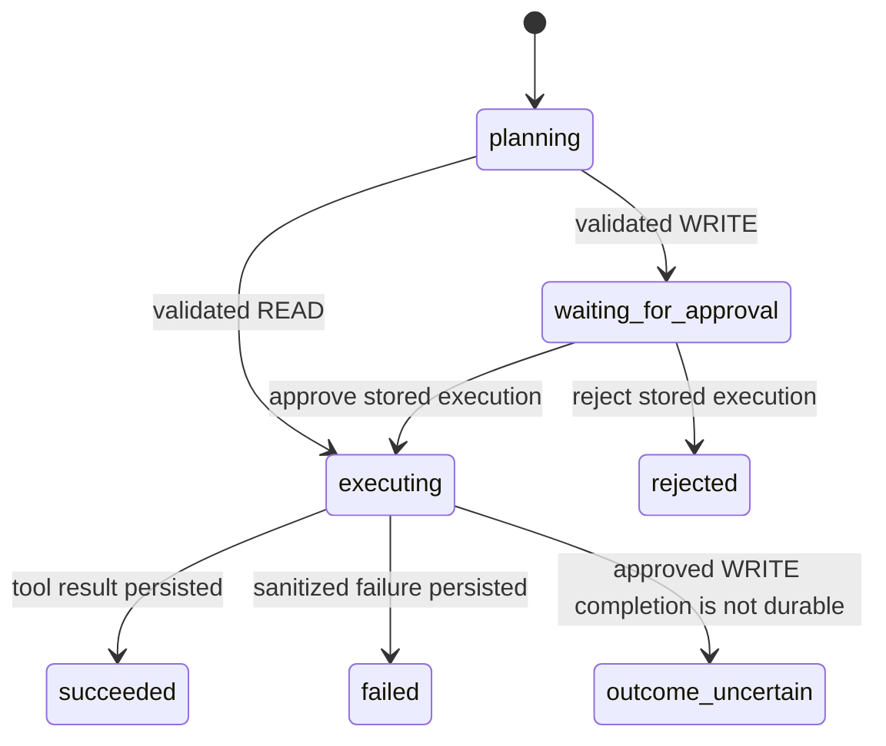

# Architecture

## Phase 3.2 boundary

AURA remains a modular monolith with a React frontend, FastAPI backend, and PostgreSQL database. Phase 3 extends the validated Phase 2 seam without changing the planner or provider contracts:

- `frontend/` owns the browser application and explicit approval controls.
- `backend/app/api/` owns typed HTTP contracts, including payload-free approve/reject endpoints.
- `backend/app/core/` owns application configuration.
- `backend/app/database/` owns SQLAlchemy metadata and session construction.
- `backend/app/services/` owns lifecycle transitions, approval decisions, row locking, and persistence coordination.
- `backend/app/agents/` owns the validated single-step plan and execution boundary.
- `backend/app/providers/` owns the provider protocol, sanitized failure taxonomy, and OpenAI SDK adapter.
- `backend/app/tools/` owns tool schemas, the READ/WRITE policy, the registry/executor, and fixed-root workspace operations.
- `backend/app/models/` owns tasks, plans, executions, tool calls, and approval records.
- `backend/alembic/` owns the matching schema migrations.

The planner still produces exactly one step. Read-only tasks execute synchronously after plan validation. A write task is committed as `waiting_for_approval` with a pending approval record and returns without running the tool. Approve/reject endpoints accept only the task identifier: arguments are reloaded from the stored plan/tool call. Browser decisions require an action-matching `X-AURA-Decision` header and, when an `Origin` header is present, an exact configured frontend origin. PostgreSQL row locking and a durable transition out of the waiting state prevent repeated decisions from executing the same action twice.

## Tool and permission boundary

Every registered tool declares a name, description, JSON-compatible argument schema, and application-owned permission. `READ` tools may execute automatically. `WRITE` tools are blocked by `ToolExecutor` unless application code passes the approval capability after a persisted approval transition. Planner output cannot set or alter permissions.

The registered Phase 3 tools are:

- `workspace_list`: list top-level names and kinds.
- `workspace_search`: literal case-insensitive file-name/content search with bounded query length, result count, scanned-file count, input file size, and excerpt size.
- `workspace_read`: read one UTF-8 text file up to 256 KiB.
- `workspace_move`: move or rename one regular file into an existing workspace directory without overwriting.

All path-bearing tools accept only normalized workspace-relative paths. Absolute paths and `..` traversal are rejected. On native Windows, device names, alternate streams, trailing-dot/space aliases, and reparse points are also rejected without imposing Windows filename rules inside Linux containers.

Filesystem access is acquired through one internal platform boundary rather than validating a pathname and opening it later. Linux uses a held workspace descriptor plus `openat2` beneath/no-symlink resolution; Windows holds non-delete-shared handles for each verified non-reparse component. Opened objects are type-checked, reads reject non-regular files, and platforms without the required guarantees fail closed. `workspace_list` and `workspace_search` cap visited entries, visited directories, depth, traversal work, returned items/bytes, and search input bytes without first materializing an unbounded directory.

Moves use an atomic primitive with replacement disabled: descriptor-relative `renameat2(RENAME_NOREPLACE)` on Linux and source-handle `FileRenameInfo` on Windows while the verified destination chain is locked. There is no link/unlink rollback and no overwrite fallback.

There is no shell, delete operation, arbitrary command execution, user-controlled workspace root, multi-step planning, or autonomous loop.

## Provider boundary

`LLMPlanner` receives the registered tool definitions but never receives `WORKSPACE_ROOT` or a filesystem handle. Its strict structured-output schema allows exactly one step and uses a tool-specific argument branch for every registered tool. AURA independently validates the returned plan model, registered name, and selected argument schema before persistence. `MockPlanner` remains deterministic and provider-free for normal CI.

## Approval lifecycle

Approval changes are terminal once the execution leaves `waiting_for_approval`. Completed, executing, failed, rejected, and uncertain tasks return a conflict for further decisions. When a WRITE task begins waiting, AURA stores an application-generated workspace identity and source-file precondition on the approval record; this internal metadata is not part of planner or API input. Approval is persisted before a write runs. Execution reacquires the source and rejects changed workspace/source state as a terminal safe failure, so a fresh task is required. The final tool, execution, and task outcome is committed afterward.

Every persistence recovery first locks the task row and compares the complete persisted lifecycle snapshot expected by that specific failed operation. A mismatch means a concurrent decision or terminal outcome has won and recovery changes nothing. A failed decision commit preserves the pending approval rather than manufacturing an outcome. If an approved WRITE returns but its completion commit fails, task, execution, and tool call are atomically recorded as `outcome_uncertain`; the approval remains `approved`, results are cleared, and the tool is never automatically invoked again.

At process startup, one bounded synchronous reconciliation pass locks up to 100 pre-existing `executing` tasks. Stranded approved WRITEs become `outcome_uncertain`; stranded READs become `failed`. Reconciliation only inspects persisted lifecycle metadata and never calls the planner, agent engine, registry, or tool executor.

## Phase boundary

Phase 3.2 intentionally stops at lifecycle and browser decision-boundary hardening for one planned invocation. Authentication, memory, multiple agents, queues, retries, streaming, web browsing, advanced observability, deletion, shell access, and Phase 4 behavior remain out of scope.
