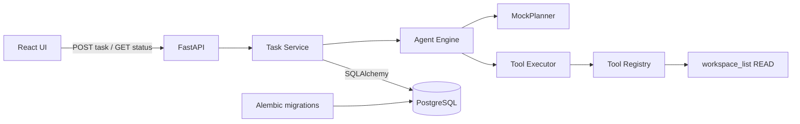

# Architecture

## Phase 1 boundary

AURA remains a modular monolith with a React frontend, FastAPI backend, and PostgreSQL database. Phase 1 fills only the boundaries needed for the first deterministic vertical slice:

- `frontend/` owns the browser application.
- `backend/app/api/` owns typed HTTP contracts.
- `backend/app/core/` owns application configuration.
- `backend/app/database/` owns SQLAlchemy metadata and session construction.
- `backend/app/services/` owns task lifecycle transitions and persistence coordination.
- `backend/app/agents/` owns the validated plan contract, deterministic planner, and single-step engine.
- `backend/app/tools/` owns the tool contract, registry, executor, and fixed-root read-only workspace listing.
- `backend/app/models/` owns task, plan, execution, and tool-call records.
- `backend/alembic/` owns the matching schema migration.

The request runs synchronously because Phase 1 executes exactly one bounded read-only call. Lifecycle states are still committed at task creation, planning, execution start, and completion so each record is durable. A failed tool call is returned as a persisted operational failure rather than exposing an internal traceback.

## Dependency direction

The API calls the task service; the service coordinates persistence and the agent engine; the engine depends on planner and tool-executor contracts. Infrastructure modules do not depend on the HTTP layer. `MockPlanner` is deterministic and validates its structured output. A vendor-neutral AI provider is intentionally deferred to Phase 2.

## Phase boundary

This phase exposes only task creation and task retrieval. It registers exactly one tool and does not accept a path from the planner or user; `WORKSPACE_ROOT` is the execution boundary. Provider integrations, additional tools, approval workflows, authentication, memory, multiple agents, destructive actions, and advanced observability remain out of scope until their roadmap phases.
