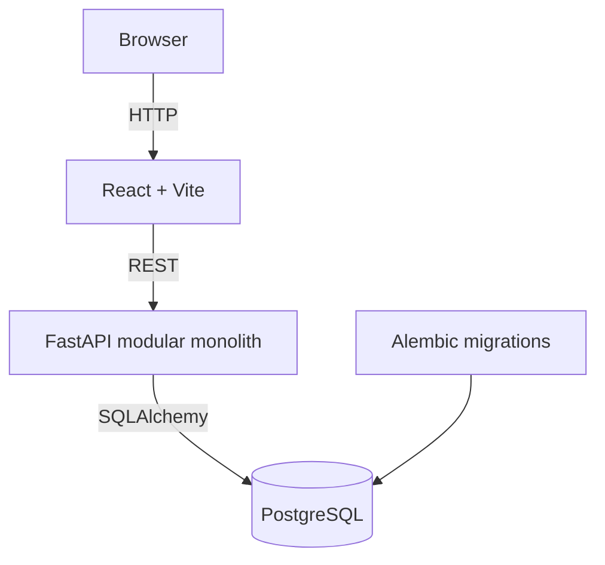

# Architecture

## Phase 0 boundary

AURA starts as a modular monolith with two deployable application shells and one PostgreSQL database. Phase 0 intentionally implements only the foundation:

- `frontend/` owns the browser application.
- `backend/app/api/` owns typed HTTP contracts.
- `backend/app/core/` owns application configuration.
- `backend/app/database/` owns SQLAlchemy metadata and session construction.
- `backend/app/{agents,models,services,tools}/` reserve the blueprint's module boundaries without implementing later-phase behavior.
- `backend/alembic/` owns database schema evolution. No initial revision exists because Phase 0 introduces no domain tables.

## Dependency direction

The API may call services; services may coordinate database, agent, and tool modules. Infrastructure modules must not depend on the HTTP layer. The future agent engine will depend on an internal provider interface rather than a vendor SDK.

## Phase boundary

Phase 1 will add the first coherent vertical slice: task creation, a deterministic mock plan, one registered tool execution, PostgreSQL persistence, and dashboard presentation. Provider integrations, approval workflows, memory, and advanced observability remain out of scope until their roadmap phases.
